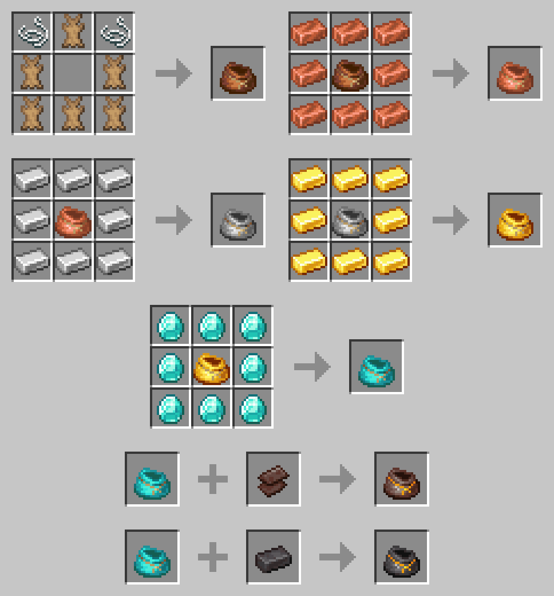

# Expanded Iron Bundles
Small mod that provides bundles with more storage space, and new functionalities in the future.

[See on Modrinth](https://modrinth.com/mod/expanded-iron-bundles) 
[See on CurseForge](https://www.curseforge.com/minecraft/mc-mods/expanded-iron-bundles-fabric)

## Current features
* Recipe for the vanilla bundle
* Multiple variants with more storage space and special properties
  * Copper Bundle (128 slots / 2 stacks)
  * Iron Bundle (256 slots / 4 stacks)
  * Gold Bundle (384 slots / 6 stacks)
  * Diamond Bundle (512 slots / 8 stacks)
  * Obsidian Bundle (768 slots / 12 stacks)
  * Ancient Scraps Bundle (896 slots / 14 stacks)
  * Netherite Bundle (1024 slots / 16 stacks & Immune to fire and lava)

## Planned features
* Versions for Forge and previous versions of Minecraft
* A config file to enable/disable specific bundles, change capacity
* Better visuals for the occupancy bar
* More bundles with special mechanics (i.e.: Ender Bundle, ...)
* Bundle upgrades (i.e.: Piston to throw items further, ...)
* Improved bundle mechanics (i.e.: Swapping last inserted item, Throw a single stack, ...)

### Fabric source code
* [1.19 / 1.19.1](https://github.com/aziascreations/MC-Expanded-Iron-Bundles/tree/fabric-1.19) - *'fabric-1.19'* branch

### Forge source code
* Should be coming soon...

### Recipes

## License
[Apache V2](LICENSE)
