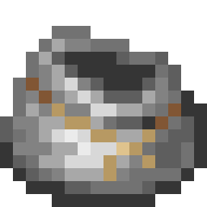

# Expanded Iron Bundles
Small mod that provides bundles with more storage space, and new functionalities in the future.

## Features
### Current
* Recipe for the vanilla bundle
* Multipla variants with more storage space and special properties
  * Copper Bundle (128 slots / 2 stacks)
  * Iron Bundle (256 slots / 4 stacks)
  * Gold Bundle (384 slots / 6 stacks)
  * Diamond Bundle (512 slots / 8 stacks)
  * Ancient Scraps Bundle (896 slots / 14 stacks & Immune to fire and lava)
  * Netherite Bundle (1024 slots / 16 stacks & Immune to fire and lava)

### Planned
* Versions for Forge and previous versions of Minecraft
* A config file to enable/disable specific bundles, change capacity
* Better visuals for the occupancy bar
* More bundles with special mecanics (i.e.: Ender Bundle, ...)
* Bundle modifiers (i.e.: Piston to throw items further, ...)
* Imrpoved bundle mecanics (i.e.: Swapping last inserted item, Thrown single stack, ...)

## Versions
### Fabric
* 1.18 and earlier - Should be comming soon...
* [1.19 / 1.19.1](https://github.com/aziascreations/MC-Expanded-Iron-Bundles/tree/fabric-1.19)

### Forge
Should be comming soon...

## Links
TODO

## License
[Apache V2](LICENSE)
