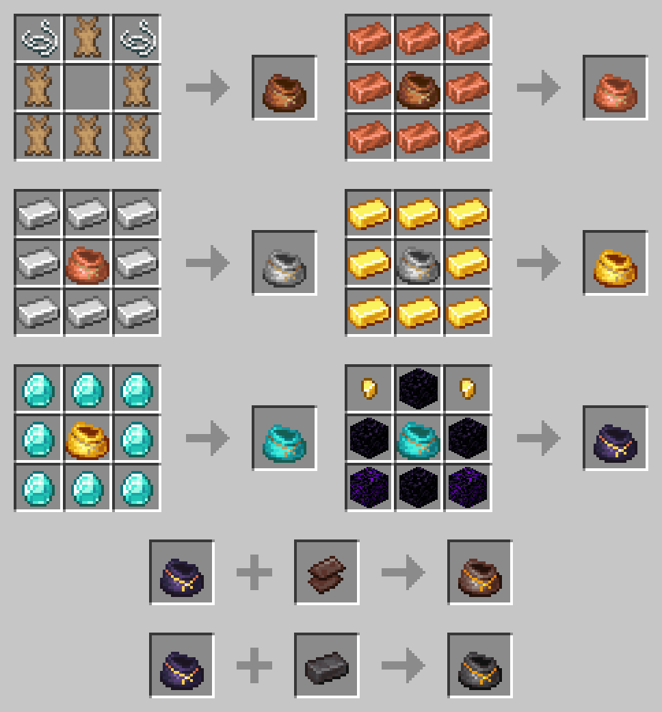

# Expanded Iron Bundles
Small mod that provides bundles with more storage space, and new functionalities in the future.

[See on Modrinth](https://modrinth.com/mod/expanded-iron-bundles) 
[See on CurseForge](https://www.curseforge.com/minecraft/mc-mods/expanded-iron-bundles-fabric)

## Current features
* Recipe for the vanilla bundle
* Multiple variants with more storage space and special properties:
  * Copper Bundle (128 slots / 2 stacks)
  * Iron Bundle (256 slots / 4 stacks)
  * Gold Bundle (384 slots / 6 stacks)
  * Diamond Bundle (512 slots / 8 stacks)
  * Obsidian Bundle (768 slots / 12 stacks)
  * Ancient Scraps Bundle (896 slots / 14 stacks)
  * Netherite Bundle (1024 slots / 16 stacks & Immune to fire and lava)
  
## Comming in v0.0.4
* Improved base mechanics:
  * Throw out a single item type when sneaking.
* Ability to filter insertions for a single item type while doubling capacity.
* Ability to upgrade bundles to give them special abilities:
  * Powered launch <i>(Items thrown go further)</i>
  * Composting <i>(Any compostable item inserted will be transformed to bonemeal)</i>
  * Voiding <i>(Delete any inserted item)</i>

## Planned features
* Versions for Forge and previous versions of Minecraft
* A config file to enable/disable specific bundles, change capacity
* Better visuals for the occupancy bar
* More bundles with special mechanics (i.e.: Ender Bundle, ...)
* More bundle upgrades
* Improved bundle mechanics (i.e.: Swapping last inserted item, ...)
* Support for modded ores and modded clones of existing ores

### New Bundle Mechanics

#### Filters
Filters can be defined by right-clicking on an item or block while holding any set or unset filter in any inventory-like container. 
Once set, they can also be cleared by putting them in a crafting table.

To apply them to a bundle, you simply need to put a filter with any bundle in a crafting grid. 
Any existing item in the bundle that doesn't match the filter can ony be removed and will still take space. 
A blank filter will remove any filter from a bundle, and any item that occupy space over the limit will only be removable.

#### Upgrades
Upgrade are permanent modifications that can be applied in a limited number to a bundle in order to change its behaviour. 
These upgrades are added through the <i>Smithing Table</i>.

#### Overflowing Bundles
Any bundle that may contain more items than it should be able to will be considered as overflowing. 
Overflowing bundles will have a redish item bar, a different texture and won't be able to insert any more items.

This type of bundle can be "created" when you reduce the maximum size of a bundle, or when you remove a filter from a bundle.

### Fabric source code
* [1.19 / 1.19.1](https://github.com/aziascreations/MC-Expanded-Iron-Bundles/tree/fabric-1.19) - *'fabric-1.19'* branch

### Forge source code
* Should be coming soon...

### Recipes

### Known Issues
* The original bundle is not showing in the creative menu
* Recipes aren't unlocked when picking up one of the ingredients
* The bundle's inventory preview shows a cross when the occupancy reaches 64 or more
* Unstackable items such as weapons, tools and totems can be stacked when removing them from any inventory-like container.

## License
[Apache V2](LICENSE)
